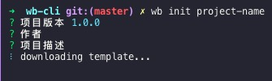
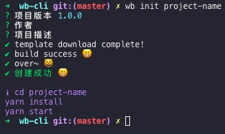
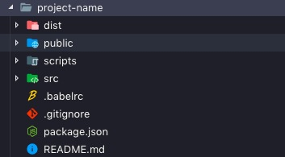

# wb-cli-react
自己的命令行工具。

本来叫做 `wb-cli` ,但是被抢先注册了。

# 用法
```sh
  npm install -g wb-cli-react
```

如果想要把当前目录作为开发目录的话：
```sh
  wb init
```


如果要新建一个目录：
```sh
  wb init project-name
```


完成之后的效果：



来看看我们创建项目：



# 运行项目
```sh
  cd project-name && yarn install
  yarn start
```
